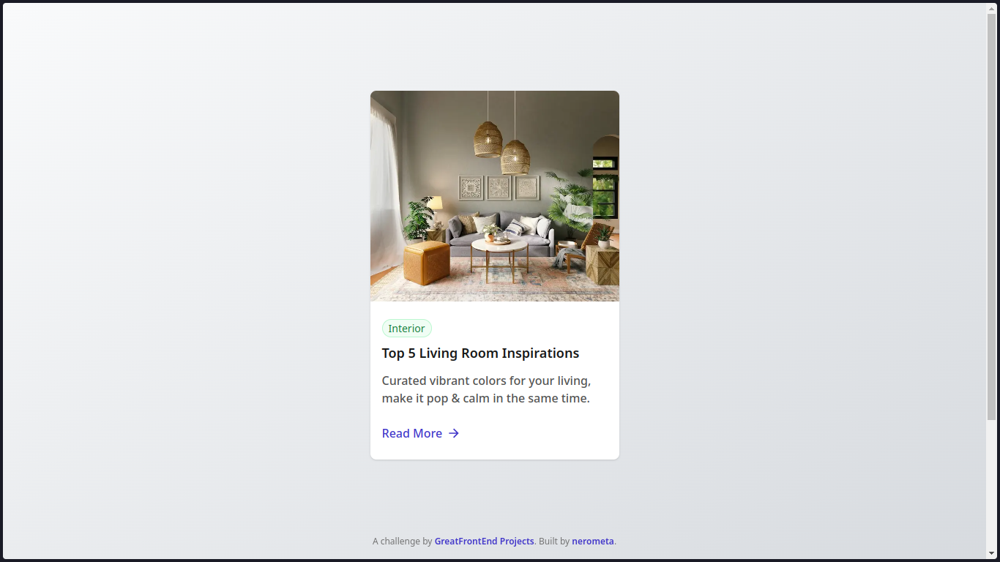

# Blog Card

[![Feature-Sliced Design][shields-fsd-image]](https://feature-sliced.design/)

Blog Card is the second project out of 25 from GreatFrontEnd Projects' [Marketing Track](https://www.greatfrontend.com/projects/tracks/marketing). Really clean looking blog card with image. You can see it in action [here](https://nerometa.github.io/greatfrontend-projects/blog-card), or [try it out](https://www.greatfrontend.com/projects/challenges/blog-card) for yourself.

I also tried [Feature-Sliced Design](https://feature-sliced.design/) on this project. Pretty overkill, I guess, but I liked it and I see myself using it more in the future.

## Screenshots

## Tech Stack

[Back to the collections](https://github.com/nerometa/greatfrontend-projects)
-> Next Project (This is a link to the next project on the track. Coming out soon.)
