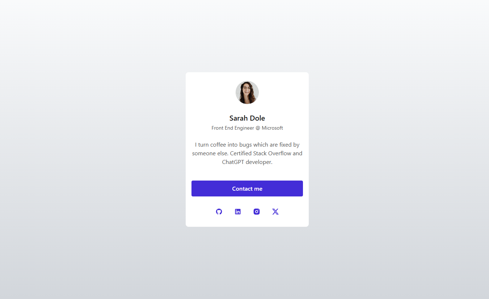

# Profile Card

Profile Card is the third project out of 25 from GreatFrontEnd Projects' [Marketing Track](https://www.greatfrontend.com/projects/tracks/marketing). You can see it in action [here](https://nerometa.github.io/greatfrontend-projects/profile-card), or [try it out](https://www.greatfrontend.com/projects/challenges/profile-card) for yourself.

## Screenshots

## Tech Stack

[Back to the collections](https://github.com/nerometa/greatfrontend-projects)
-> Next Project (This is a link to the next project on the track. Coming out soon.)