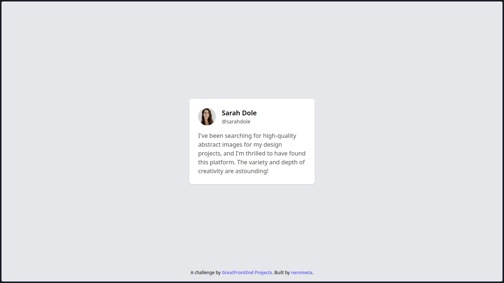

# Testimonial Card

Testimonial Card is the first project out of 25 from GreatFrontEnd Projects' [Marketing Track](https://www.greatfrontend.com/projects/tracks/marketing). It is just a simple user testimonial card. It has a nice design and is responsive. You can see it in action [here](https://nerometa.github.io/greatfrontend-projects/testimonial-card), or [try it out](https://www.greatfrontend.com/projects/challenges/testimonial-card) for yourself.

## Screenshots

## Tech Stack

[Back to the collections](https://github.com/nerometa/greatfrontend-projects)
[Next Project > Blog Card](https://github.com/nerometa/greatfrontend-projects/tree/main/blog-card)
